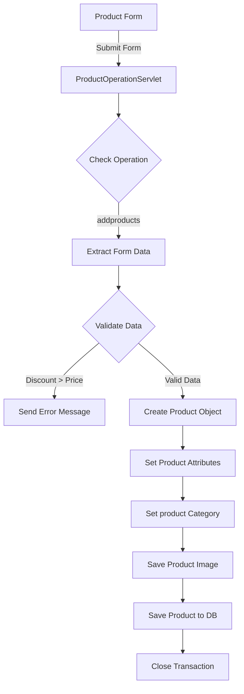

# Introduction

This document will walk you through the process of adding a product.

The feature allows administrators to add new products to the e-commerce platform via a web form. We will cover:

1. How the form is structured in the admin interface.
2. How the form data is processed in the servlet.
3. The conditions and decisions made during the product addition process.
4. How the product data is saved to the database.



# Form structure in admin interface

<SwmSnippet path="/src/main/webapp/admin.jsp" line="111">

---

The form in <SwmPath>[src/main/webapp/admin.jsp](/src/main/webapp/admin.jsp)</SwmPath> is designed to collect all necessary product details from the administrator. It includes fields for product title, description, price, discount, quantity, category, and an image upload.

```
       <form action="ProductOperationServlet" method="post" enctype="multipart/form-data">
      		<input type="hidden" name="operation" value="addproducts"/>
			 <div class="form-group">
			    Product Title:<input type="text" class="form-control" name="pname"  placeholder="Enter Product Title" required>
			  </div>

			  <div class="form-group">
			   Product Desc:<textarea  style="height: 100px;" class="form-control" name="pdesc" placeholder="Enter Product Description" required ></textarea>
			  </div>
			  <div class="form-group">
			    Product Price:<input type="number" class="form-control" name="pprice"  placeholder="Enter Product Price" required>
			  </div>
			  
			   <div class="form-group">
			    Product Discount:<input type="number" class="form-control" name="pdiscount"  placeholder="Enter Product Discount" required>
			  </div>
			  
			   <div class="form-group">
			    Product Quantity:<input type="number" class="form-control" name="pquantity"  placeholder="Enter Product Quantity" required>
			  </div>
```

---

</SwmSnippet>

<SwmSnippet path="/src/main/webapp/admin.jsp" line="131">

---

The form also dynamically populates the category options by fetching them from the database.

```
			<% 
				CategoryDao cdao=new CategoryDao(FactoryProvider.getFactory());
				List<Category>list=cdao.getCategories();
			%>
			<div class="form-group">
				
				<select type="number" name="catsid" class="form-control">
				<%
				 for(Category c: list){
					%>
					<option value=" <%= c.getCategoryId()%>"><%= c.getCategoryTitle() %></option>
					<%
					}
					%>
					
				
				</select>
				</div>
			 
			 <div class="from-group">
			 	Product Pic:<br><input type="file" name="ppic" requried/>
			 </div>
			 <div class="modal-footer">
        <button type="button" class="btn btn-secondary" data-bs-dismiss="modal">Close</button>
        <button type="submit" class="btn btn-primary">Save changes</button>
      </div>
```

---

</SwmSnippet>

<SwmSnippet path="/src/main/webapp/admin.jsp" line="90">

---

Finally, the form includes buttons to submit the data or close the modal.

```
		</form>
```

---

</SwmSnippet>

# Processing form data in the servlet

<SwmSnippet path="/src/main/java/com/ecommerce/servlets/ProductOperationServlet_copy.java" line="66">

---

When the form is submitted, the data is sent to <SwmToken path="/src/main/webapp/admin.jsp" pos="111:7:7" line-data="       &lt;form action=&quot;ProductOperationServlet&quot; method=&quot;post&quot; enctype=&quot;multipart/form-data&quot;&gt;">`ProductOperationServlet`</SwmToken>. The servlet processes the form data by extracting the parameters and converting them to the appropriate types.

```
		else if(ops.trim().equals("addproducts"))
		{
			String pname=request.getParameter("pname");
			String pdesc=request.getParameter("pdesc");
			int pprice= Integer.parseInt(request.getParameter("pprice"));
			int pdiscount= Integer.parseInt(request.getParameter("pdiscount"));
			int pquantity= Integer.parseInt(request.getParameter("pquantity"));
			String str=request.getParameter("catsid");
			int catid=Integer.parseInt(str.trim());
```

---

</SwmSnippet>

<SwmSnippet path="/src/main/java/com/ecommerce/servlets/ProductOperationServlet_copy.java" line="75">

---

This condition checks if the discount is greater than the price. If true, it sets an error message and redirects back to the admin page without saving the product.

```

      if (pdiscount > pprice) {
        response.setContentType("text/html");
        PrintWriter out = response.getWriter();
        HttpSession httpSession=request.getSession();
        httpSession.setAttribute("message", "Discount cannot be greater than price");
        response.sendRedirect("admin.jsp");
        return;
      }
			
			System.out.println(catid);
			
			Part part=request.getPart("ppic");
			
			Products product=new Products();
			
			product.setProductName(pname);
			product.setProductDiscription(pdesc);
			product.setProductPrice(pprice);
			product.setProductDiscount(pdiscount);
			product.setProductQuantity(pquantity);
			product.setProductPic(part.getSubmittedFileName());
			
			CategoryDao catdao=new CategoryDao(FactoryProvider.getFactory());
			Category cat=catdao.getCategoryById(catid);
			
			product.setCategory(cat);
			
			ProductDao pdao=new ProductDao(FactoryProvider.getFactory());
			String path=request.getRealPath("images")+File.separator +"products"+File.separator+part.getSubmittedFileName();
			System.out.println(path);
			FileOutputStream fos=new FileOutputStream(path);
			InputStream fin=part.getInputStream();
			byte[]data=new byte[fin.available()];
			
			fin.read(data);
			fos.write(data);
			fos.close();
			pdao.saveProduct(product);
		}
```

---

</SwmSnippet>

# Saving product data to the database

<SwmSnippet path="/src/main/java/com/ecommerce/servlets/ProductOperationServlet_copy.java" line="75">

---

If all conditions are met, the servlet creates a <SwmToken path="/src/main/java/com/ecommerce/servlets/ProductOperationServlet_copy.java" pos="89:1:1" line-data="			Products product=new Products();">`Products`</SwmToken> object and sets its properties. It then saves the product image to the server and persists the product data using <SwmToken path="/src/main/java/com/ecommerce/servlets/ProductOperationServlet_copy.java" pos="103:1:1" line-data="			ProductDao pdao=new ProductDao(FactoryProvider.getFactory());">`ProductDao`</SwmToken>.

```

      if (pdiscount > pprice) {
        response.setContentType("text/html");
        PrintWriter out = response.getWriter();
        HttpSession httpSession=request.getSession();
        httpSession.setAttribute("message", "Discount cannot be greater than price");
        response.sendRedirect("admin.jsp");
        return;
      }
			
			System.out.println(catid);
			
			Part part=request.getPart("ppic");
			
			Products product=new Products();
			
			product.setProductName(pname);
			product.setProductDiscription(pdesc);
			product.setProductPrice(pprice);
			product.setProductDiscount(pdiscount);
			product.setProductQuantity(pquantity);
			product.setProductPic(part.getSubmittedFileName());
			
			CategoryDao catdao=new CategoryDao(FactoryProvider.getFactory());
			Category cat=catdao.getCategoryById(catid);
			
			product.setCategory(cat);
			
			ProductDao pdao=new ProductDao(FactoryProvider.getFactory());
			String path=request.getRealPath("images")+File.separator +"products"+File.separator+part.getSubmittedFileName();
			System.out.println(path);
			FileOutputStream fos=new FileOutputStream(path);
			InputStream fin=part.getInputStream();
			byte[]data=new byte[fin.available()];
			
			fin.read(data);
			fos.write(data);
			fos.close();
			pdao.saveProduct(product);
		}
```

---

</SwmSnippet>

<SwmSnippet path="/src/main/java/com/ecommerce/dao/ProductDao.java" line="22">

---

The <SwmToken path="/src/main/java/com/ecommerce/servlets/ProductOperationServlet_copy.java" pos="113:3:3" line-data="			pdao.saveProduct(product);">`saveProduct`</SwmToken> method in <SwmToken path="/src/main/java/com/ecommerce/servlets/ProductOperationServlet_copy.java" pos="103:1:1" line-data="			ProductDao pdao=new ProductDao(FactoryProvider.getFactory());">`ProductDao`</SwmToken> handles the database transaction to save the product.

```
public void saveProduct(Products product)
{
	Session session=FactoryProvider.getFactory().openSession();
	Transaction tx=session.beginTransaction();
	
	session.save(product);
	
	tx.commit();
	
	session.close();
	}
```

---

</SwmSnippet>

This flow ensures that all necessary product details are collected, validated, and stored correctly.

<SwmMeta version="3.0.0" repo-id="Z2l0aHViJTNBJTNBZWNvbW1lcmNlLXdlYmFwcC1oaWJlcm5hdGUtc2VydmxldCUzQSUzQVN3aW1tLURlbW8=" repo-name="ecommerce-webapp-hibernate-servlet"><sup>Powered by [Swimm](https://staging.swimm.cloud/)</sup></SwmMeta>
