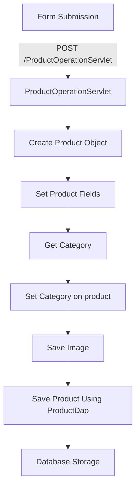

# Introduction

This document will walk you through the process of adding a product.

The feature allows administrators to add new products to the e-commerce platform through a web form. The form captures various product details and sends them to the server for processing and storage.

We will cover:

1. Form structure and data capture.
2. Server-side processing of the form data.
3. Saving the product to the database.



# Form structure and data capture

The form is defined in <SwmPath>[src/main/webapp/admin.jsp](/src/main/webapp/admin.jsp)</SwmPath>. It captures various product details such as title, description, price, discount, quantity, category, and an image.

<SwmSnippet path="/src/main/webapp/admin.jsp" line="111">

---

The form starts with the action and method attributes, specifying the servlet to handle the form submission.

```
       <form action="ProductOperationServlet" method="post" enctype="multipart/form-data">
      		<input type="hidden" name="operation" value="addproducts"/>
			 <div class="form-group">
			    Product Title:<input type="text" class="form-control" name="pname"  placeholder="Enter Product Title" required>
```

---

</SwmSnippet>

<SwmSnippet path="/src/main/webapp/admin.jsp" line="115">

---

The form captures the product description, price, discount, and quantity.

```
			  </div>

			  <div class="form-group">
			   Product Desc:<textarea  style="height: 100px;" class="form-control" name="pdesc" placeholder="Enter Product Description" required ></textarea>
			  </div>
			  <div class="form-group">
			    Product Price:<input type="number" class="form-control" name="pprice"  placeholder="Enter Product Price" required>
			  </div>
			  
			   <div class="form-group">
			    Product Discount:<input type="number" class="form-control" name="pdiscount"  placeholder="Enter Product Discount" required>
			  </div>
			  
			   <div class="form-group">
			    Product Quantity:<input type="number" class="form-control" name="pquantity"  placeholder="Enter Product Quantity" required>
			  </div>
```

---

</SwmSnippet>

<SwmSnippet path="/src/main/webapp/admin.jsp" line="131">

---

The form also includes a dropdown to select the product category and an input for the product image.

```
			<% 
				CategoryDao cdao=new CategoryDao(FactoryProvider.getFactory());
				List<Category>list=cdao.getCategories();
			%>
			<div class="form-group">
				
				<select type="number" name="catsid" class="form-control">
				<%
				 for(Category c: list){
					%>
					<option value=" <%= c.getCategoryId()%>"><%= c.getCategoryTitle() %></option>
					<%
					}
					%>
					
				
				</select>
				</div>
			 
			 <div class="from-group">
			 	Product Pic:<br><input type="file" name="ppic" requried/>
			 </div>
			 <div class="modal-footer">
        <button type="button" class="btn btn-secondary" data-bs-dismiss="modal">Close</button>
        <button type="submit" class="btn btn-primary">Save changes</button>
      </div>
```

---

</SwmSnippet>

# Server-side processing of the form data

The <SwmToken path="/src/main/webapp/admin.jsp" pos="111:7:7" line-data="       &lt;form action=&quot;ProductOperationServlet&quot; method=&quot;post&quot; enctype=&quot;multipart/form-data&quot;&gt;">`ProductOperationServlet`</SwmToken> handles the form submission. It processes the form data and creates a new product object.

<SwmSnippet path="/src/main/java/com/ecommerce/servlets/ProductOperationServlet.java" line="66">

---

The servlet checks if the operation is "addproducts" and retrieves the form data.

```
		else if(ops.trim().equals("addproducts"))
		{
			String pname=request.getParameter("pname");
			String pdesc=request.getParameter("pdesc");
			int pprice= Integer.parseInt(request.getParameter("pprice"));
			int pdiscount= Integer.parseInt(request.getParameter("pdiscount"));
			int pquantity= Integer.parseInt(request.getParameter("pquantity"));
			String str=request.getParameter("catsid");
			int catid=Integer.parseInt(str.trim());
			
			System.out.println(catid);
			
			Part part=request.getPart("ppic");
			
			Products product=new Products();
			
			product.setProductName(pname);
			product.setProductDiscription(pdesc);
			product.setProductPrice(pprice);
			product.setProductDiscount(pdiscount);
			product.setProductQuantity(pquantity);
			product.setProductPic(part.getSubmittedFileName());
			
			CategoryDao catdao=new CategoryDao(FactoryProvider.getFactory());
			Category cat=catdao.getCategoryById(catid);
			
			product.setCategory(cat);
			
			ProductDao pdao=new ProductDao(FactoryProvider.getFactory());
			String path=request.getRealPath("images")+File.separator +"products"+File.separator+part.getSubmittedFileName();
			System.out.println(path);
			FileOutputStream fos=new FileOutputStream(path);
			InputStream fin=part.getInputStream();
			byte[]data=new byte[fin.available()];
			
			fin.read(data);
			fos.write(data);
			fos.close();
			pdao.saveProduct(product);
		}
```

---

</SwmSnippet>

# Saving the product to the database

<SwmSnippet path="/src/main/java/com/ecommerce/dao/ProductDao.java" line="22">

---

The <SwmToken path="/src/main/java/com/ecommerce/dao/ProductDao.java" pos="14:4:4" line-data="public class ProductDao {">`ProductDao`</SwmToken> class is responsible for saving the product to the database. It opens a session, begins a transaction, saves the product, and commits the transaction.

```
public void saveProduct(Products product)
{
	Session session=FactoryProvider.getFactory().openSession();
	Transaction tx=session.beginTransaction();
	
	session.save(product);
	
	tx.commit();
	
	session.close();
	}
```

---

</SwmSnippet>

This flow ensures that the product details captured from the form are processed and stored correctly in the database, making the new product available on the e-commerce platform.

<SwmMeta version="3.0.0" repo-id="Z2l0aHViJTNBJTNBZWNvbW1lcmNlLXdlYmFwcC1oaWJlcm5hdGUtc2VydmxldCUzQSUzQVN3aW1tLURlbW8=" repo-name="ecommerce-webapp-hibernate-servlet"><sup>Powered by [Swimm](https://staging.swimm.cloud/)</sup></SwmMeta>
